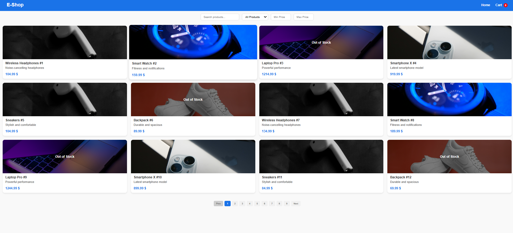
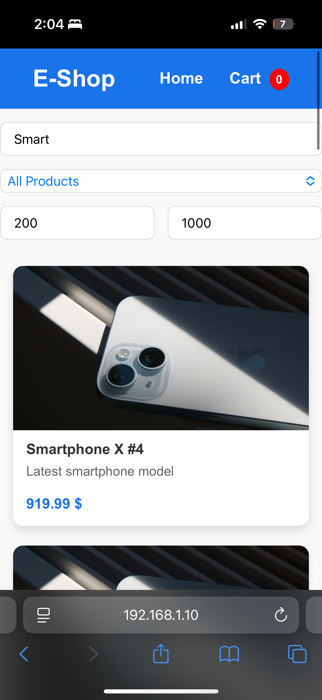

# E-Commerce Product Listing

This project is a small e-commerce product listing app.  
It was built as part of a **technical interview task** to demonstrate frontend development skills.

---

## Features
- Product listing (image, name, description, price, stock status)
- Search (with debounce to avoid too many re-renders)
- Filters:
  - Availability: in stock / out of stock
  - Price range (min–max)
- Responsive grid layout:
  - 4 columns on desktop
  - 2 on tablet
  - 1 on mobile
- Product modal with full description + Add to Cart
- Cart page:
  - Add, remove, update quantity
  - Show total
- Cart is saved in localStorage
- Simple loading skeletons + empty state message

---

## Screenshots

### Web


### Mobile


---

## Data
- Products are stored in `src/data/products.json`.
- The dataset was seeded/generated using a simple Node.js script (`scripts/seed.js`) for demo purposes.

---

## Tech Stack
- React with TypeScript
- Context API for cart
- SCSS modules
- React Router DOM
- Framer Motion (basic animations)

---

## Installation
```bash
git clone <repo-url>
cd ecommerce
npm install
npm start
